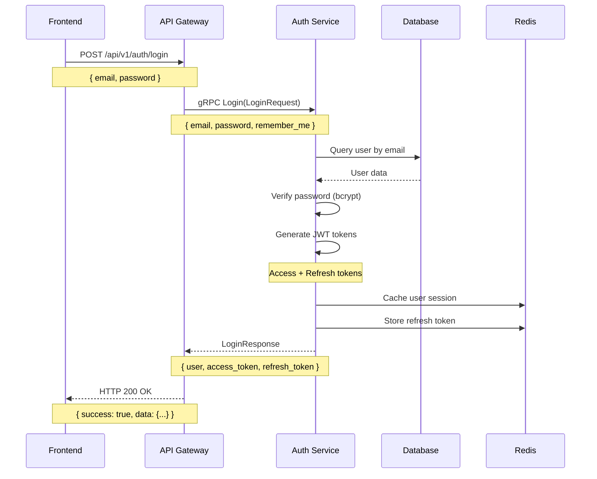
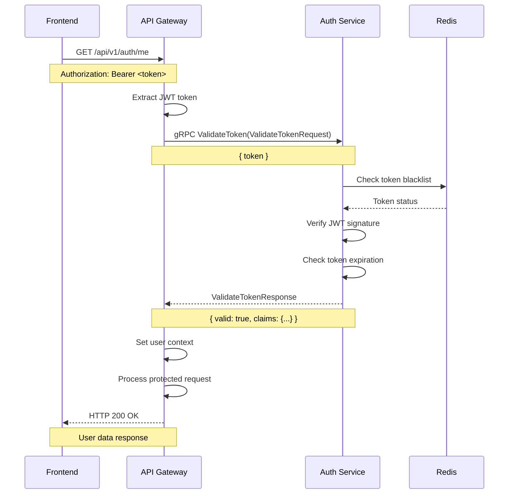
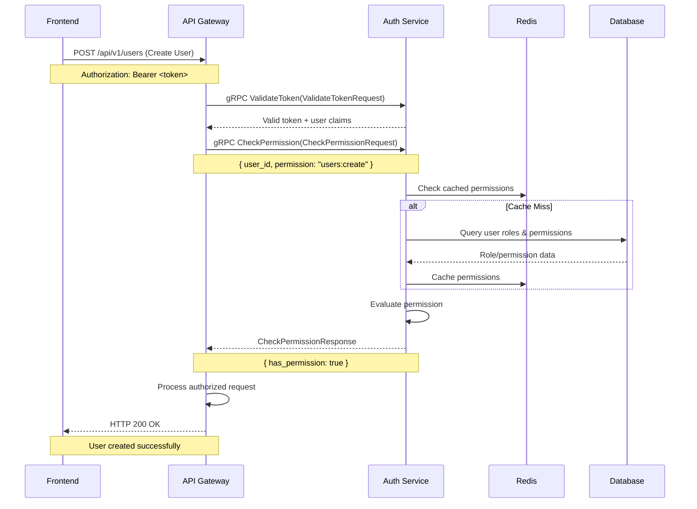

# API Gateway Authentication Architecture

## Overview

This document explains how the ERP API Gateway integrates with the Auth Service through gRPC for authentication and authorization, providing a comprehensive view of the authentication flow, API endpoints, and service connections.

## Architecture Diagram

```
┌─────────────────┐    ┌─────────────────┐    ┌─────────────────┐
│    Frontend     │    │   API Gateway   │    │  Auth Service   │
│   (Next.js)     │    │     (Go)        │    │     (Go)        │
│   Port: 3000    │    │   Port: 8000    │    │ HTTP: 8080      │
└─────────┬───────┘    └─────────┬───────┘    │ gRPC: 50051     │
          │                      │            └─────────┬───────┘
          │ HTTP/REST            │ gRPC                  │
          │                      │                      │
          ▼                      ▼                      ▼
┌─────────────────────────────────────────────────────────────────┐
│                    Request Flow                                 │
│                                                                 │
│ 1. Frontend → API Gateway (HTTP)                               │
│ 2. API Gateway → Auth Service (gRPC)                          │
│ 3. Auth Service → Database/Redis                               │
│ 4. Response flows back through the chain                       │
└─────────────────────────────────────────────────────────────────┘
```

## Service Integration Details

### API Gateway Configuration

The API Gateway is configured to communicate with the Auth Service via gRPC:

```yaml
# erp-api-gateway/config.yaml
grpc:
  auth_service:
    host: "auth-service"
    port: 50051
    timeout: "10s"
    max_retries: 3
    retry_backoff: "100ms"
    circuit_breaker:
      max_failures: 5
      timeout: "60s"
      interval: "10s"
```

### gRPC Client Implementation

The API Gateway maintains a gRPC client connection to the Auth Service:

```go
// internal/services/grpc_client/grpc_client.go
type GRPCClient struct {
    authClient authpb.AuthServiceClient
    conn       *grpc.ClientConn
}

func (c *GRPCClient) AuthService(ctx context.Context) (authpb.AuthServiceClient, error) {
    if c.authClient == nil {
        return nil, errors.New("auth service client not initialized")
    }
    return c.authClient, nil
}
```## Authen
tication Flow Diagrams

### 1. User Login Flow



### 2. Token Validation Flow



### 3. Permission Check Flow



## API Endpoints

### API Gateway REST Endpoints

#### Authentication Endpoints

| Method | Endpoint | Description | Auth Required |
|--------|----------|-------------|---------------|
| POST | `/api/v1/auth/login` | User login | No |
| POST | `/api/v1/auth/register` | User registration | No |
| POST | `/api/v1/auth/refresh` | Refresh access token | No |
| POST | `/api/v1/auth/logout` | User logout | Yes |
| GET | `/api/v1/auth/me` | Get current user | Yes |

#### Example Request/Response

**Login Request:**
```bash
curl -X POST http://localhost:8000/api/v1/auth/login \
  -H "Content-Type: application/json" \
  -d '{
    "email": "user@example.com",
    "password": "securepassword123",
    "remember_me": true
  }'
```

**Login Response:**
```json
{
  "success": true,
  "data": {
    "user": {
      "id": "123e4567-e89b-12d3-a456-426614174000",
      "first_name": "John",
      "last_name": "Doe",
      "email": "user@example.com",
      "created_at": "2024-01-01T00:00:00Z"
    },
    "access_token": "eyJhbGciOiJSUzI1NiIsInR5cCI6IkpXVCJ9...",
    "refresh_token": "eyJhbGciOiJSUzI1NiIsInR5cCI6IkpXVCJ9...",
    "expires_in": 3600
  },
  "message": "Login successful"
}
```

### Auth Service gRPC Methods

#### Core Authentication Methods

| Method | Purpose | Performance |
|--------|---------|-------------|
| `Login` | User authentication | ~50ms |
| `ValidateToken` | JWT token validation | <10ms (cached) |
| `RefreshToken` | Token refresh | ~30ms |
| `RevokeToken` | Token revocation | ~20ms |
| `CheckPermission` | Permission validation | <15ms (cached) |

#### gRPC Service Definition

```protobuf
service AuthService {
  // Core authentication
  rpc Login(LoginRequest) returns (LoginResponse);
  rpc ValidateToken(ValidateTokenRequest) returns (ValidateTokenResponse);
  rpc RefreshToken(RefreshTokenRequest) returns (RefreshTokenResponse);
  rpc RevokeToken(RevokeTokenRequest) returns (RevokeTokenResponse);
  
  // User management
  rpc GetUser(GetUserRequest) returns (GetUserResponse);
  rpc CreateUser(CreateUserRequest) returns (CreateUserResponse);
  rpc UpdateUser(UpdateUserRequest) returns (UpdateUserResponse);
  
  // Permission management
  rpc CheckPermission(CheckPermissionRequest) returns (CheckPermissionResponse);
  rpc BulkCheckPermissions(BulkCheckPermissionsRequest) returns (BulkCheckPermissionsResponse);
  
  // Health check
  rpc HealthCheck(HealthCheckRequest) returns (HealthCheckResponse);
}
```

## Authentication Middleware

### JWT Authentication Middleware

The API Gateway uses JWT authentication middleware to protect endpoints:

```go
// middleware/auth.go
func (m *AuthMiddleware) RequireAuth() gin.HandlerFunc {
    return func(c *gin.Context) {
        // Extract token from Authorization header
        token := m.extractToken(c)
        if token == "" {
            c.JSON(401, gin.H{"success": false, "message": "Authorization header required"})
            c.Abort()
            return
        }
        
        // Validate token via gRPC call to Auth Service
        authClient, err := m.grpcClient.AuthService(c.Request.Context())
        if err != nil {
            c.JSON(500, gin.H{"success": false, "message": "Authentication service unavailable"})
            c.Abort()
            return
        }
        
        validateResp, err := authClient.ValidateToken(c.Request.Context(), &authpb.ValidateTokenRequest{
            Token: token,
        })
        
        if err != nil || !validateResp.Valid {
            c.JSON(401, gin.H{"success": false, "message": "Invalid token"})
            c.Abort()
            return
        }
        
        // Set user context for downstream handlers
        c.Set("user_id", validateResp.Claims.UserId)
        c.Set("user_email", validateResp.Claims.Email)
        c.Set("user_roles", validateResp.Claims.Roles)
        c.Set("user_permissions", validateResp.Claims.Permissions)
        
        c.Next()
    }
}
```

### RBAC Middleware

Role-based access control middleware for permission checking:

```go
// middleware/rbac.go
func (m *RBACMiddleware) RequirePermission(permission string) gin.HandlerFunc {
    return func(c *gin.Context) {
        userID, exists := c.Get("user_id")
        if !exists {
            c.JSON(401, gin.H{"success": false, "message": "Authentication required"})
            c.Abort()
            return
        }
        
        // Check permission via gRPC call to Auth Service
        authClient, err := m.grpcClient.AuthService(c.Request.Context())
        if err != nil {
            c.JSON(500, gin.H{"success": false, "message": "Authorization service unavailable"})
            c.Abort()
            return
        }
        
        permResp, err := authClient.CheckPermission(c.Request.Context(), &authpb.CheckPermissionRequest{
            UserId:     userID.(string),
            Permission: permission,
        })
        
        if err != nil || !permResp.HasPermission {
            c.JSON(403, gin.H{"success": false, "message": "Insufficient permissions"})
            c.Abort()
            return
        }
        
        c.Next()
    }
}
```

## Auth Service Implementation

### Authentication Service

The Auth Service handles authentication logic and JWT token management:

```go
// internal/application/services/auth_service.go
type AuthService struct {
    userRepo    domain.UserRepository
    tokenSvc    *TokenService
    cache       cache.Manager
    eventPub    events.Publisher
}

func (s *AuthService) Authenticate(ctx context.Context, email, password string) (*domain.User, *TokenPair, error) {
    // Get user from database
    user, err := s.userRepo.GetByEmail(ctx, email)
    if err != nil {
        return nil, nil, errors.New("invalid credentials")
    }
    
    // Verify password
    if !s.verifyPassword(password, user.PasswordHash) {
        // Publish failed login event
        s.eventPub.PublishAuthEvent(ctx, events.LoginFailed{
            UserID: user.ID,
            Email:  email,
            IP:     getClientIP(ctx),
        })
        return nil, nil, errors.New("invalid credentials")
    }
    
    // Generate tokens
    tokens, err := s.tokenSvc.GenerateTokenPair(ctx, user)
    if err != nil {
        return nil, nil, err
    }
    
    // Cache user session
    s.cache.SetUserSession(ctx, user.ID, tokens.AccessToken)
    
    // Publish successful login event
    s.eventPub.PublishAuthEvent(ctx, events.LoginSuccess{
        UserID: user.ID,
        Email:  email,
        IP:     getClientIP(ctx),
    })
    
    return user, tokens, nil
}
```

### Token Service

JWT token generation and validation:

```go
// internal/application/services/token_service.go
type TokenService struct {
    signingKey   []byte
    cache        cache.Manager
    tokenRepo    domain.TokenRepository
}

func (s *TokenService) ValidateToken(ctx context.Context, tokenString string) (*Claims, error) {
    // Check token blacklist in cache
    if s.cache.IsTokenBlacklisted(ctx, tokenString) {
        return nil, errors.New("token is blacklisted")
    }
    
    // Parse and validate JWT
    token, err := jwt.ParseWithClaims(tokenString, &Claims{}, func(token *jwt.Token) (interface{}, error) {
        return s.signingKey, nil
    })
    
    if err != nil || !token.Valid {
        return nil, errors.New("invalid token")
    }
    
    claims := token.Claims.(*Claims)
    
    // Check token expiration
    if claims.ExpiresAt.Before(time.Now()) {
        return nil, errors.New("token expired")
    }
    
    return claims, nil
}
```

### Permission Service

RBAC permission evaluation:

```go
// internal/application/services/permission_service.go
type PermissionService struct {
    userRepo  domain.UserRepository
    roleRepo  domain.RoleRepository
    cache     cache.Manager
}

func (s *PermissionService) CheckPermission(ctx context.Context, userID, permission string) (bool, error) {
    // Check cached permissions first
    if hasPermission, found := s.cache.GetUserPermission(ctx, userID, permission); found {
        return hasPermission, nil
    }
    
    // Get user with roles and permissions
    user, err := s.userRepo.GetWithRoles(ctx, userID)
    if err != nil {
        return false, err
    }
    
    // Check direct permissions
    for _, perm := range user.Permissions {
        if perm.Name == permission {
            s.cache.SetUserPermission(ctx, userID, permission, true)
            return true, nil
        }
    }
    
    // Check role-based permissions
    for _, role := range user.Roles {
        for _, perm := range role.Permissions {
            if perm.Name == permission {
                s.cache.SetUserPermission(ctx, userID, permission, true)
                return true, nil
            }
        }
    }
    
    s.cache.SetUserPermission(ctx, userID, permission, false)
    return false, nil
}
```

## Database Schema

### Core Tables

```sql
-- Users table
CREATE TABLE users (
    id UUID PRIMARY KEY DEFAULT gen_random_uuid(),
    email VARCHAR(255) UNIQUE NOT NULL,
    password_hash VARCHAR(255) NOT NULL,
    first_name VARCHAR(100) NOT NULL,
    last_name VARCHAR(100) NOT NULL,
    is_active BOOLEAN DEFAULT true,
    email_verified_at TIMESTAMP,
    created_at TIMESTAMP DEFAULT NOW(),
    updated_at TIMESTAMP DEFAULT NOW()
);

-- Roles table
CREATE TABLE roles (
    id UUID PRIMARY KEY DEFAULT gen_random_uuid(),
    name VARCHAR(100) UNIQUE NOT NULL,
    description TEXT,
    created_at TIMESTAMP DEFAULT NOW()
);

-- Permissions table
CREATE TABLE permissions (
    id UUID PRIMARY KEY DEFAULT gen_random_uuid(),
    name VARCHAR(100) UNIQUE NOT NULL,
    resource VARCHAR(100) NOT NULL,
    action VARCHAR(100) NOT NULL,
    description TEXT,
    created_at TIMESTAMP DEFAULT NOW()
);

-- User roles junction table
CREATE TABLE user_roles (
    user_id UUID REFERENCES users(id) ON DELETE CASCADE,
    role_id UUID REFERENCES roles(id) ON DELETE CASCADE,
    assigned_at TIMESTAMP DEFAULT NOW(),
    PRIMARY KEY (user_id, role_id)
);

-- Role permissions junction table
CREATE TABLE role_permissions (
    role_id UUID REFERENCES roles(id) ON DELETE CASCADE,
    permission_id UUID REFERENCES permissions(id) ON DELETE CASCADE,
    PRIMARY KEY (role_id, permission_id)
);

-- Refresh tokens table
CREATE TABLE refresh_tokens (
    id UUID PRIMARY KEY DEFAULT gen_random_uuid(),
    user_id UUID REFERENCES users(id) ON DELETE CASCADE,
    token_hash VARCHAR(255) NOT NULL,
    expires_at TIMESTAMP NOT NULL,
    created_at TIMESTAMP DEFAULT NOW(),
    revoked_at TIMESTAMP
);

-- Indexes for performance
CREATE INDEX idx_users_email ON users(email);
CREATE INDEX idx_refresh_tokens_user_id ON refresh_tokens(user_id);
CREATE INDEX idx_refresh_tokens_expires_at ON refresh_tokens(expires_at);
CREATE INDEX idx_user_roles_user_id ON user_roles(user_id);
CREATE INDEX idx_role_permissions_role_id ON role_permissions(role_id);
```

## Caching Strategy

### Redis Cache Structure

```
# User sessions
user:session:{user_id} -> {access_token, expires_at}

# Token blacklist
token:blacklist:{token_hash} -> {revoked_at}

# User permissions cache
user:permissions:{user_id}:{permission} -> {has_permission, expires_at}

# User roles cache
user:roles:{user_id} -> {roles[], expires_at}

# Rate limiting
rate_limit:login:{ip} -> {attempts, window_start}
rate_limit:api:{user_id} -> {requests, window_start}
```

### Cache Invalidation Strategy

```go
// Cache invalidation on user updates
func (s *AuthService) InvalidateUserCache(ctx context.Context, userID string) error {
    patterns := []string{
        fmt.Sprintf("user:session:%s", userID),
        fmt.Sprintf("user:permissions:%s:*", userID),
        fmt.Sprintf("user:roles:%s", userID),
    }
    
    for _, pattern := range patterns {
        if err := s.cache.DeletePattern(ctx, pattern); err != nil {
            return err
        }
    }
    
    return nil
}
```

## Performance Optimizations

### Connection Pooling

```go
// gRPC connection pool configuration
func (c *GRPCClient) createConnection(serviceName string) (*grpc.ClientConn, error) {
    opts := []grpc.DialOption{
        grpc.WithKeepaliveParams(keepalive.ClientParameters{
            Time:                10 * time.Second,
            Timeout:             3 * time.Second,
            PermitWithoutStream: true,
        }),
        grpc.WithDefaultCallOptions(
            grpc.MaxCallRecvMsgSize(4*1024*1024), // 4MB
            grpc.MaxCallSendMsgSize(4*1024*1024), // 4MB
        ),
    }
    
    return grpc.Dial(serviceConfig.Address, opts...)
}
```

### Circuit Breaker

```go
// Circuit breaker for Auth Service calls
type CircuitBreaker struct {
    failures    int64
    lastFailure time.Time
    state       string // CLOSED, OPEN, HALF_OPEN
    threshold   int
    timeout     time.Duration
}

func (cb *CircuitBreaker) Allow() bool {
    if cb.state == "OPEN" {
        if time.Since(cb.lastFailure) > cb.timeout {
            cb.state = "HALF_OPEN"
            return true
        }
        return false
    }
    return true
}
```

## Security Considerations

### Token Security

- **Short-lived access tokens**: 15-minute expiration
- **Refresh token rotation**: New refresh token on each use
- **Token blacklisting**: Immediate revocation capability
- **Secure storage**: HttpOnly cookies for web clients

### Rate Limiting

- **Login attempts**: 5 attempts per IP per minute
- **API requests**: 100 requests per user per minute
- **Token validation**: 1000 requests per minute (cached)

### Input Validation

```go
// Request validation middleware
func ValidateLoginRequest(req *LoginRequest) error {
    if req.Email == "" {
        return errors.New("email is required")
    }
    
    if !isValidEmail(req.Email) {
        return errors.New("invalid email format")
    }
    
    if len(req.Password) < 8 {
        return errors.New("password must be at least 8 characters")
    }
    
    return nil
}
```

## Monitoring and Observability

### Metrics Collection

```go
// Prometheus metrics
var (
    authRequestsTotal = prometheus.NewCounterVec(
        prometheus.CounterOpts{
            Name: "auth_requests_total",
            Help: "Total number of authentication requests",
        },
        []string{"method", "status"},
    )
    
    authRequestDuration = prometheus.NewHistogramVec(
        prometheus.HistogramOpts{
            Name: "auth_request_duration_seconds",
            Help: "Authentication request duration",
        },
        []string{"method"},
    )
)
```

### Health Checks

```go
// Health check endpoint
func (s *Server) healthCheck(c *gin.Context) {
    health := gin.H{
        "status":    "healthy",
        "timestamp": time.Now().Unix(),
        "services": gin.H{
            "auth_service": s.checkAuthService(),
            "database":     s.checkDatabase(),
            "redis":        s.checkRedis(),
        },
    }
    
    c.JSON(http.StatusOK, health)
}
```

## Error Handling

### Structured Error Responses

```go
type ErrorResponse struct {
    Success bool                    `json:"success"`
    Message string                  `json:"message"`
    Errors  map[string][]string     `json:"errors"`
    Code    string                  `json:"code,omitempty"`
}

// Example error response
{
  "success": false,
  "message": "Authentication failed",
  "errors": {
    "email": ["Invalid email format"],
    "password": ["Password is required"]
  },
  "code": "VALIDATION_ERROR"
}
```

### gRPC Error Handling

```go
// Convert gRPC errors to HTTP errors
func handleGRPCError(err error) (int, ErrorResponse) {
    st, ok := status.FromError(err)
    if !ok {
        return 500, ErrorResponse{
            Success: false,
            Message: "Internal server error",
        }
    }
    
    switch st.Code() {
    case codes.Unauthenticated:
        return 401, ErrorResponse{
            Success: false,
            Message: "Authentication required",
            Code:    "UNAUTHENTICATED",
        }
    case codes.PermissionDenied:
        return 403, ErrorResponse{
            Success: false,
            Message: "Insufficient permissions",
            Code:    "PERMISSION_DENIED",
        }
    default:
        return 500, ErrorResponse{
            Success: false,
            Message: "Internal server error",
        }
    }
}
```

## Deployment Configuration

### Docker Compose

```yaml
# docker-compose.yml
services:
  api-gateway:
    build: ./erp-api-gateway
    ports:
      - "8000:8000"
    environment:
      - GRPC_AUTH_SERVICE=auth-service:50051
    depends_on:
      - auth-service
      - redis
    
  auth-service:
    build: ./erp-auth-service
    ports:
      - "8080:8080"
      - "50051:50051"
    environment:
      - DB_HOST=postgres
      - REDIS_HOST=redis
    depends_on:
      - postgres
      - redis
```

### Kubernetes Deployment

```yaml
# api-gateway-deployment.yaml
apiVersion: apps/v1
kind: Deployment
metadata:
  name: api-gateway
spec:
  replicas: 3
  selector:
    matchLabels:
      app: api-gateway
  template:
    metadata:
      labels:
        app: api-gateway
    spec:
      containers:
      - name: api-gateway
        image: erp-api-gateway:latest
        ports:
        - containerPort: 8000
        env:
        - name: GRPC_AUTH_SERVICE
          value: "auth-service:50051"
        resources:
          requests:
            memory: "256Mi"
            cpu: "250m"
          limits:
            memory: "512Mi"
            cpu: "500m"
```

This comprehensive documentation covers the complete authentication architecture, showing how the API Gateway and Auth Service work together to provide secure, scalable authentication and authorization for the ERP system.