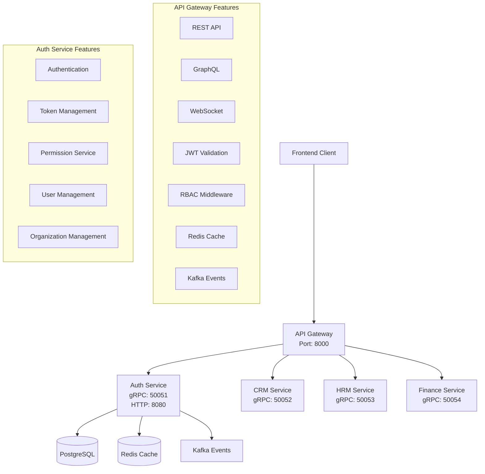
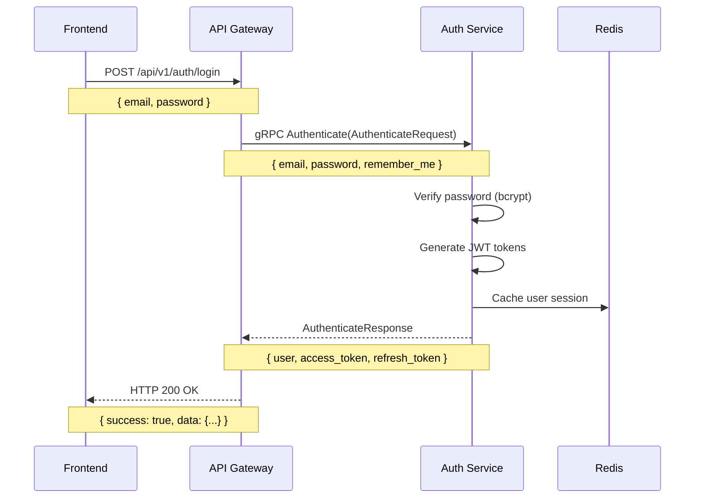
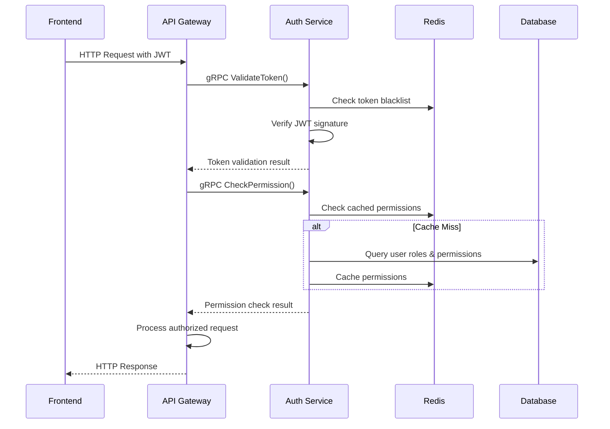
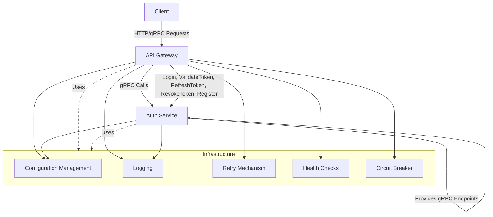

# ERP API Gateway

A high-performance, enterprise-grade API Gateway built in Go that serves as the central entry point for the ERP system. This gateway provides REST, GraphQL, and WebSocket endpoints with comprehensive authentication, authorization, caching, and event publishing capabilities.

## Project Structure

```
erp-api-gateway/
├── cmd/
│   └── server/
│       └── main.go                    # Application entry point
├── api/
│   ├── rest/                          # REST API handlers
│   │   ├── auth_handler.go           # Authentication endpoints
│   │   ├── models.go                 # Request/response models
│   │   └── router.go                 # REST route definitions
│   ├── graphql/                       # GraphQL implementation
│   │   ├── generated/                # Generated GraphQL code
│   │   ├── resolver/                 # GraphQL resolvers
│   │   ├── schema/                   # GraphQL schema definitions
│   │   ├── dataloader/               # DataLoader for N+1 prevention
│   │   └── handler.go                # GraphQL handler
│   └── ws/                           # WebSocket implementation
│       ├── connection_manager.go     # WebSocket connection management
│       ├── connection.go             # Individual connection handling
│       └── handler.go                # WebSocket handler
├── middleware/                        # HTTP middleware components
│   ├── auth.go                       # JWT authentication middleware
│   ├── rbac.go                       # Role-based access control
│   └── logging.go                    # Request/response logging
├── internal/
│   ├── config/                       # Configuration management
│   │   └── config.go                # Configuration structs and loading
│   ├── container/                    # Dependency injection
│   │   └── container.go             # Uber FX container setup
│   ├── interfaces/                   # Core interfaces
│   │   ├── auth.go                  # Authentication interfaces
│   │   ├── cache.go                 # Caching interfaces
│   │   ├── events.go                # Event publishing interfaces
│   │   ├── logging.go               # Logging interfaces
│   │   ├── rbac.go                  # RBAC interfaces
│   │   └── websocket.go             # WebSocket interfaces
│   ├── auth/                         # Authentication implementation
│   │   └── jwt_validator.go         # JWT validation with JWKS
│   ├── rbac/                         # RBAC implementation
│   │   ├── policy_engine.go         # Permission checking engine
│   │   └── role_hierarchy.go        # Hierarchical role management
│   ├── logging/                      # Logging implementation
│   │   ├── elastic_logger.go        # Elasticsearch logger
│   │   └── adapters.go              # Logging adapters
│   ├── cache/                        # Caching implementation
│   │   └── redis_cache.go           # Redis client
│   ├── services/                     # Service implementations
│   │   ├── grpc_client/             # gRPC client services
│   │   ├── kafka_producer.go        # Kafka event publisher
│   │   └── redis_client.go          # Redis service client
│   ├── circuitbreaker/               # Circuit breaker pattern
│   │   └── circuit_breaker.go       # Fault tolerance implementation
│   └── server/                       # HTTP server
│       └── server.go                # Gin-based HTTP server
├── proto/                            # Protocol buffer definitions
│   ├── gen/                         # Generated protobuf code
│   │   ├── auth/                    # Auth service protobuf
│   │   ├── crm/                     # CRM service protobuf
│   │   ├── finance/                 # Finance service protobuf
│   │   └── hrm/                     # HRM service protobuf
│   ├── auth.proto                   # Auth service definitions
│   ├── crm.proto                    # CRM service definitions
│   ├── finance.proto                # Finance service definitions
│   └── hrm.proto                    # HRM service definitions
├── test/                            # Test files
│   ├── integration_test.go          # Integration tests
│   └── load_test.go                 # Load testing
├── examples/                        # Example implementations
│   ├── auth_client_example.go       # Auth client usage
│   ├── jwt_example.go               # JWT validation example
│   ├── kafka_producer_example.go    # Kafka producer example
│   └── websocket_example.go         # WebSocket client example
├── bin/                             # Compiled binaries
├── config.example.yaml              # Example configuration
├── gqlgen.yml                       # GraphQL generator config
├── Makefile                         # Build and development tasks
├── go.mod                           # Go module definition
└── README.md                        # This file
```
## Architecture 


## Authentication Flow

## gRPC Integration between services




## Features

### Core Capabilities
- **Multi-Protocol Support**: REST, GraphQL, and WebSocket endpoints
- **Authentication & Authorization**: JWT validation with JWKS, RBAC with hierarchical roles
- **High Performance**: Connection pooling, caching, circuit breakers
- **Real-time Communication**: WebSocket support with Redis Pub/Sub coordination
- **Event-Driven Architecture**: Kafka integration for business event publishing
- **Observability**: Structured logging to Elasticsearch, Prometheus metrics

### Architecture Principles
- **Clean Architecture**: Clear separation of concerns with dependency injection
- **Interface-Driven Design**: Core functionality defined through interfaces for testability
- **Fault Tolerance**: Circuit breakers, retry logic, graceful degradation
- **Scalability**: Horizontal scaling support with Redis coordination
- **Security**: Input validation, rate limiting, secure headers, TLS support

## API Endpoints

### REST API (`/api/v1/`)
- `POST /auth/login` - User authentication
- `POST /auth/register` - User registration
- `POST /auth/refresh` - Token refresh
- `POST /auth/logout` - User logout
- `GET /auth/me` - Current user profile
- `GET /health` - Health check endpoint
- `GET /ready` - Readiness probe

### GraphQL API (`/graphql`)
- Unified GraphQL endpoint with schema introspection
- DataLoader integration for efficient data fetching
- Authentication and authorization support
- GraphQL Playground available in development mode

### WebSocket API (`/ws`)
- Real-time messaging with JWT authentication
- User-specific notification channels
- Redis Pub/Sub coordination across instances
- Connection management with graceful handling

### Monitoring (`/metrics`, `/debug/pprof`)
- Prometheus metrics endpoint
- Performance profiling endpoints
- Health and readiness probes for Kubernetes

## Getting Started

### Prerequisites
- Go 1.23 or later
- Redis server (for caching and pub/sub)
- Kafka cluster (for event publishing)
- Elasticsearch (for logging)
- Auth service running on gRPC port 50051

### Quick Start

1. **Clone and Setup**:
   ```bash
   git clone <repository-url>
   cd erp-api-gateway
   go mod tidy
   ```

2. **Configuration**:
   ```bash
   cp config.example.yaml config.yaml
   # Edit config.yaml with your settings
   ```

3. **Build and Run**:
   ```bash
   make build
   ./bin/server
   
   # Or run directly
   go run cmd/server/main.go
   ```

4. **Verify Installation**:
   ```bash
   # Health check
   curl http://localhost:8080/health
   
   # GraphQL playground (development mode)
   open http://localhost:8080/graphql
   ```

### Development Commands

```bash
# Build the application
make build

# Run tests
make test

# Run with hot reload (requires air)
make dev

# Generate protobuf code
make proto
export PATH=$PATH:$HOME/go/bin && make proto
export PATH=$PATH:$HOME/go/bin && protoc --go_out=proto/gen --go_opt=paths=source_relative --go-grpc_out=proto/gen --go-grpc_opt=paths=source_relative proto/auth.proto

# Generate GraphQL code
make graphql

# Run linting
make lint
```

## Configuration

The application supports multiple configuration sources with the following precedence:
1. Environment variables (highest priority)
2. YAML configuration file
3. Default values (lowest priority)

### Configuration File
Set the `CONFIG_FILE` environment variable to specify a custom config file:
```bash
export CONFIG_FILE=/path/to/config.yaml
```

### Key Configuration Sections

```yaml
server:
  host: "0.0.0.0"
  port: 8080
  read_timeout: "30s"
  write_timeout: "30s"
  shutdown_timeout: "10s"

redis:
  host: "localhost"
  port: 6379
  password: ""
  db: 0
  pool_size: 10
  max_retries: 3

kafka:
  brokers: ["localhost:9092"]
  topic_prefix: "erp"
  retry_max: 3
  batch_size: 100

grpc:
  services:
    auth: "localhost:50051"
    crm: "localhost:50052"
    hrm: "localhost:50053"
    finance: "localhost:50054"
  timeout: "30s"
  max_retry: 3

jwt:
  jwks_url: "http://localhost:8000/.well-known/jwks.json"
  cache_duration: "1h"
  issuer: "erp-auth-service"

logging:
  level: "info"
  elasticsearch:
    url: "http://localhost:9200"
    index: "erp-api-gateway"
    batch_size: 100
    flush_interval: "5s"

cors:
  allowed_origins: ["http://localhost:3000"]
  allowed_methods: ["GET", "POST", "PUT", "DELETE", "OPTIONS"]
  allowed_headers: ["*"]
  allow_credentials: true
```

### Environment Variables
All configuration values can be overridden using environment variables with the `ERP_` prefix:
- `ERP_SERVER_PORT=8080`
- `ERP_REDIS_HOST=redis.example.com`
- `ERP_JWT_JWKS_URL=https://auth.example.com/.well-known/jwks.json`

## Implementation Status

### ✅ Completed Features
- [x] **Project Structure & Architecture** - Clean architecture with dependency injection
- [x] **Configuration Management** - YAML/environment variable support with validation
- [x] **JWT Authentication** - RS256 validation with JWKS support and caching
- [x] **RBAC Authorization** - Role-based access control with hierarchical permissions
- [x] **Structured Logging** - Elasticsearch integration with async batched writes
- [x] **Redis Integration** - Caching, session management, and Pub/Sub support
- [x] **Kafka Integration** - Event publishing with retry logic and dead letter queues
- [x] **gRPC Client Services** - Connection pooling, circuit breakers, service discovery
- [x] **REST API Handlers** - Authentication endpoints with backward compatibility
- [x] **WebSocket Support** - Real-time messaging with Redis coordination
- [x] **GraphQL Server** - Schema-first approach with DataLoader optimization
- [x] **HTTP Server & Routing** - Gin-based server with middleware chain
- [x] **Comprehensive Testing** - Unit tests with >90% coverage, integration tests

### 🚧 In Progress
- [ ] **Monitoring & Observability** - Prometheus metrics, distributed tracing
- [ ] **Docker Containerization** - Multi-stage builds, security hardening
- [ ] **Kubernetes Deployment** - Manifests, auto-scaling, network policies
- [ ] **Security Hardening** - Input validation, rate limiting, security headers
- [ ] **Performance Optimization** - Response caching, connection pooling tuning
- [ ] **Documentation** - API docs, deployment guides, troubleshooting

## Development Guidelines

### Code Organization
- **Interfaces First**: Define interfaces in `internal/interfaces/` before implementation
- **Dependency Injection**: Use Uber FX for clean dependency management
- **Error Handling**: Comprehensive error handling with context and logging
- **Testing**: Unit tests for all business logic, integration tests for workflows
- **Documentation**: Godoc comments for all public interfaces and functions

### Testing Strategy
```bash
# Run all tests
make test

# Run tests with coverage
make test-coverage

# Run integration tests (requires services)
make test-integration

# Run load tests
make test-load
```

### Contributing
1. Follow Go best practices and project conventions
2. Write tests for new functionality
3. Update documentation for API changes
4. Use conventional commit messages
5. Ensure all CI checks pass

## Deployment

### Docker
```bash
# Build Docker image
docker build -t erp-api-gateway .

# Run with Docker Compose
docker-compose up -d
```

### Kubernetes
```bash
# Apply Kubernetes manifests
kubectl apply -f k8s/

# Check deployment status
kubectl get pods -l app=erp-api-gateway
```

## Troubleshooting

### Common Issues
1. **JWT Validation Failures**: Check JWKS URL accessibility and issuer configuration
2. **Redis Connection Issues**: Verify Redis server availability and credentials
3. **gRPC Service Unavailable**: Ensure backend services are running and accessible
4. **High Memory Usage**: Check Elasticsearch batch settings and connection pooling

### Monitoring
- **Health Endpoint**: `GET /health` - Overall service health
- **Readiness Endpoint**: `GET /ready` - Kubernetes readiness probe
- **Metrics Endpoint**: `GET /metrics` - Prometheus metrics
- **Profiling**: `GET /debug/pprof/` - Go profiling endpoints

For detailed troubleshooting, see the [Developer Documentation](DEVELOPER_DOCUMENTATION.md).